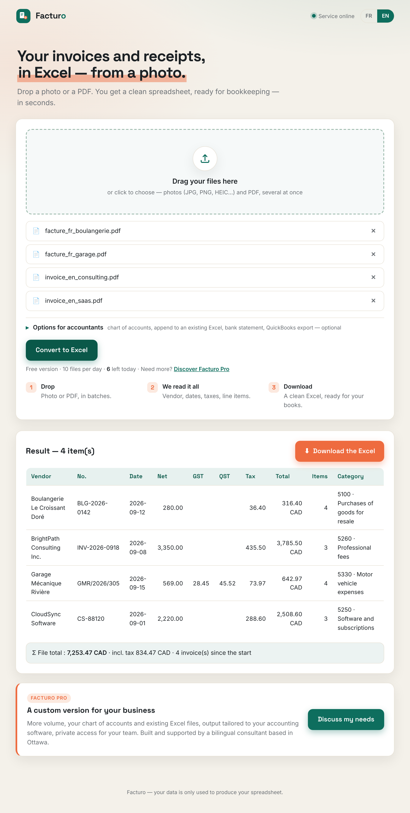
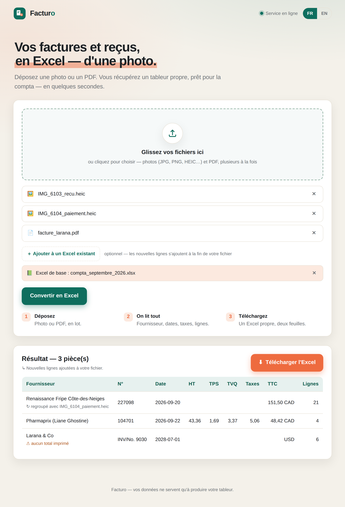

# Facturo — from photo to spreadsheet

**English** · [Français](README.fr.md)

**▶ Live demo: [facturo-ow5a.onrender.com](https://facturo-ow5a.onrender.com)** — bilingual app, English & French
<sub>Free hosting: the first load may take up to a minute. Demo limited to 10 files per day per visitor.</sub>

Facturo reads **invoices and receipts** (photos or PDFs, in English or French)
and exports them to a **clean Excel workbook** with two sheets: `Resume`
(one row per document) and `Details` (line items). Drag-and-drop web app with
a one-click **EN/FR** language switch, plus a command-line tool.

<p align="center">
  
  
</p>

## Tech stack

Python 3.11 · FastAPI · multimodal LLM (Anthropic or OpenAI API, schema-constrained
JSON output) · pdfplumber / PyMuPDF · Pillow (HEIC) · openpyxl · pytest · Docker ·
continuous deployment on Render.

## Features

- **Photos AND PDFs** — `.jpg .png .heic/.heif .webp` and PDF. Photos and scanned
  PDFs go through a vision model; text PDFs are extracted directly. No manual
  conversion needed.
- **Reliable extraction** via LLM → validated, structured JSON.
- **Canadian sales taxes** — GST/TPS and QST/TVQ broken out separately; HST and
  GST+PST handled in the tax total.
- **Grouping** of documents from the same purchase (itemized receipt + payment slip).
- **Append to an existing Excel file** — new rows are added at the end, nothing
  is overwritten: keep your books up to date as you go.
- **Consistency checks** (net + taxes ≈ total, sum of lines ≈ net) flagged in an
  *Alertes* column.
- **Bilingual** — interface and documents in English and French; the Excel file
  (sheet names, column titles, warnings) follows the language you work in, and
  an existing file is recognized in either language.

## Quick start

```bash
python -m venv .venv && source .venv/bin/activate      # Windows: .venv\Scripts\activate
pip install -r requirements.txt
cp .env.example .env        # then set ANTHROPIC_API_KEY (or OPENAI_API_KEY)

# Web app (http://localhost:7860)
export $(grep -v '^#' .env | xargs)     # load the key
python interface_web.py

# Command line
python facture_vers_excel.py exemples/factures_demo/*.pdf -o output.xlsx
python facture_vers_excel.py receipt.heic --ajouter-a my_books.xlsx -o my_books.xlsx
```

Without an API key, offline mode only works on text PDFs: `--moteur tables`.

## Project layout

```
facturo/
├── facture_vers_excel.py   # engine: extraction (PDF/vision) + Excel + CLI
├── interface_web.py        # FastAPI web app (bilingual EN/FR)
├── requirements.txt
├── Dockerfile              # deployment image
├── LICENSE
├── tests/                  # self-contained test suite (pytest)
└── exemples/               # demo PDFs, generator, UI screenshots
```

The codebase itself is written in French (function and variable names), the
author's first language.

## Tests

```bash
pip install -r requirements-dev.txt
pytest -q
```

The tests are self-contained (they generate their own inputs and mock the LLM):
no network calls, no API key required.

## Deployment

The app is containerized (`Dockerfile`) and runs as-is on any Docker platform
(Render, Fly.io, Hugging Face Spaces…). It listens on `$PORT` (default 7860).
The API key is provided through an environment variable (`ANTHROPIC_API_KEY` or
`OPENAI_API_KEY`) stored as a platform secret — never in the code.

To protect the API budget of a public demo, a daily quota applies:
`QUOTA_JOUR_TOTAL` (default 30 files/day) and `QUOTA_JOUR_VISITEUR` (default
10 files/day per IP address).

## License

© 2026 Mohamed Luc Aurel Degnon — all rights reserved. The code is published for
viewing only; any reuse, copying or redistribution requires written permission.
See [LICENSE](LICENSE).
